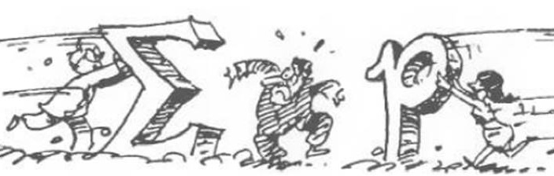
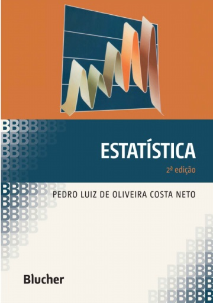

```{r setup, include=FALSE}
options(htmltools.dir.version = FALSE)
knitr::opts_chunk$set(echo = FALSE, 
                      comment = '',
                      message = FALSE,
                      warning = FALSE,
                      cache = TRUE)
```
<style> 
#caixa {
  border: 1px solid;
  padding: 10px;
  box-shadow: 5px 10px blue;
}
div {
  text-align: justify;
  text-justify: inter-word;
}
</style>

# Formação &#127891;

&#10004; Bacharel em Estatística

```{r , echo=FALSE, fig.align = 'center', out.width = '35%'}
knitr::include_graphics('figuras/fct.jpg')
```

<br>

--

&#10004; Mestrado e Doutorado em Ciências

```{r , echo=FALSE, fig.align = 'center', out.width = '45%'}
knitr::include_graphics('figuras/esalq.jpg')
```

---

# Universidades &#127979;

&#10004; Unoeste

```{r , echo=FALSE, fig.align = 'center', out.width = '25%'}
knitr::include_graphics('figuras/logo_unoeste.jpg')
```

<br>

&#10004; UEM

```{r , echo=FALSE, fig.align = 'center', out.width = '25%'}

```

<br>

&#10004; UTFPR

```{r , echo=FALSE, fig.align = 'center', out.width = '25%'}
knitr::include_graphics('figuras/utfpr.jpg')
```

---

# Apresentar-se

- Nome

<br>

- Se você fosse dono de uma fábrica de alimentos, quais qualificações você olharia para contratar uma pessoa? 

```{r , echo=FALSE, fig.align = 'right', out.width = '60%'}
knitr::include_graphics('https://media.giphy.com/media/TKNGghpLhaz9XH1tSj/giphy.gif')
```

---

# Objetivo da disciplina &#127919;

<div id="caixa">
 <div>O objetivo é proporcionar aos alunos de Tecnologia em Alimentos uma introdução aos <font color="#0066cc">conceitos de estatística</font> utilizados na análise de dados, bem como o desenvolvimento da capacidade de <font color="#0066cc">interpretar os resultados</font> e estabelecer uma linguagem comum entre o Tecnólogo e o Estatístico.</div>
</div>

<br>

.pull-left[
Horário da Aula &#9200;
]
.pull-right[
- Quarta-feira das 21:20--23:00

- Quinta-feira das 21:20--23:00
]

<br>

--

.pull-left[
Horário de Atendimento &#9200;
]
.pull-right[
- Terça-feira das 20:20-21:10

- Quinta-feira das 20:20-21:10
]

---

# Conteúdo Programático &#128214;

&#10004; Conceitos básicos de estatística descritiva

```{r , echo=FALSE, fig.align = 'center', out.width = '40%'}
knitr::include_graphics('figuras/fig2.jpg')
```

<br>

--

&#10004; Conceitos básicos Variável aleatória e modelos de distribuição de probabilidade.

```{r , echo=FALSE, fig.align = 'center', out.width = '50%'}

```

---

&#10004; Conceitos básicos de inferência estatística.

```{r , echo=FALSE, fig.align = 'center', out.width = '50%'}
knitr::include_graphics('figuras/fig5.jpg')
```

<br>

--

&#10004; Ajuste de curvas.

```{r , echo=FALSE, fig.align = 'center', out.width = '40%'}
set.seed(02032023)
x <- rnorm(15,10,1)
y <- 2+(5*x)+rnorm(15,0,1)
df <- data.frame(x,y)
library(ggplot2)
df |> 
  ggplot(aes(x = x,y = y)) +
  geom_point(size = 3) +
  geom_smooth(method = lm, se = FALSE, linewidth = 2)
```

---

# Bibliografia básica &#128218;

&#10004; Costa Neto, Pedro Luiz de Oliveira. **Estatística**. 2ed. São Paulo: Blucher, 2022.

```{r , echo=FALSE, fig.align = 'center', out.width = '35%'}

```

---

# Bibliografia básica &#128218;

&#10004; BUSSAB, Wilton de Oliveira; MORETTIN, Pedro Alberto. **Estatística básica**. 5ed. São Paulo: Saraiva, 2004.

```{r , echo=FALSE, fig.align = 'center', out.width = '35%'}
knitr::include_graphics('figuras/fig8.jpg')
```

---

# Bibliografia complementar &#128218;

- MORETTIN, L.G. **Estatística básica: probabilidade e inferência**, volume único. São Paulo: Pearson Prentice Hall, 2009. 375 p.

<br>

- SPIEGEL, M.R.; SCHILLER, J.J.; SRINIVASAN, R.A. **Teoria e problemas de probabilidade e estatística**. 2.ed. São Paulo: McGraw-Hill, 2004. 398 p.

<br>

- FONSECA, J.S.; MARTINS, G.A. **Curso de estatística**. 6.ed. São Paulo: Atlas, 1996. 320 p. 

---

# Aulas &#128105;&#8205;&#127979;

&#10004; **Prestar atenção** no que está sendo copiado e no que está sendo discutido.

&#10004; **Participar da resolução** dos exemplos.

&#10004; **Questionar** quando tiver dúvidas.

```{r , echo=FALSE, fig.align = 'right', out.width = '60%'}
knitr::include_graphics('https://media.giphy.com/media/STThOmSL9X8jpaEqfE/giphy.gif')
```

---

# Lista de exercícios &#9997;

Haverá listas de exercícios para serem resolvidas em casa. Resolver os problemas da lista de exercícios é uma forma de aprendizagem, pois é uma maneira de colocar em prática tudo que você leu e ouviu, e vai lhe fornecer um *feedback* sobre o que foi abordado em sala de aula.

```{r, eval=FALSE, echo=FALSE, fig.align = 'center', out.width = '55%'}
knitr::include_graphics('figuras/fig10.jpg')
```

```{r , echo=FALSE, fig.align = 'center', out.width = '30%'}
knitr::include_graphics('https://media.giphy.com/media/1oBwBVLGoLteCP2kyD/giphy.gif')
```

&#10004; Vocês são **encorajados** a resolver problemas com os outros estudantes, compartilhar e discutir ideias.

&#10004; As respostas de cada problema devem ser **resultados de seu próprio esforço**.

---

# Complementação de carga horária

.pull-left[
&#10004; Quizzes.

&#10004; Atividade extraclasse.
]
.pull-right[

]

<br>

```{r , echo=FALSE, fig.align = 'right', out.width = '40%'}
knitr::include_graphics('https://media.giphy.com/media/xTiQywlOn0gKyz0l56/giphy.gif')
```

---

# Provas &#128221;

Haverá três avaliações (**sem consulta**) que vão cobrir o conteúdo abordado em sala de aula, as listas de exercícios e as bibliografias citadas. As soluções de cada uma das provas devem estar bem **organizadas** e **justificadas**. Desta forma, você irá demonstrar sua capacidade de comunicar os seus resultados. Se a prova estiver **difícil de compreender** devido a organização e passagens não justificadas, haverá **penalidades**.

Qualquer conflito com as datas das provas devem ser comunicados na **segunda semana de aula**.

<br>

.pull-left[
<center>Prova 1</center>

Quarta-feira, **23/04**
]
.pull-right[
<center>Prova 2</center>

Quarta-feira, **04/06**
]

.pull-left[
<center>Prova 3</center>

Quarta-feira, **02/07**
]
.pull-right[
]

---

# Prova de segunda chamada &#128221;

No caso do aluno perder, **por motivo de doença ou força maior**, alguma avaliação, poderá solicitar, através de requerimento, uma única segunda chamada por avaliação, desde que no prazo determinado no Regulamento da Organização Didático-Pedagógica dos Cursos da UTFPR (Art.36 - Graduação e Art.31 - Técnico)

<br>

.pull-left[
<center>Prova de Segunda Chamada</center>

Quinta-feira, **10/07**
]
.pull-right[

]

<br>

Trabalho ou viagem a passeio **não são motivos** para segunda chamada.

---

# Atividades semanais &#128221;

Haverá nove atividades avaliativas (**com consulta**) ao longo do semestre que vão cobrir o conteúdo abordado em sala de aula.

<br>

--

Cada atividades avaliativa terá uma **nota máxima de 2,0** pontos.

<br>

--

Para média será considerado das atividades.

---

# Cópia de provas (e/ou *internet*) e falsidade

```{r , echo=FALSE, fig.align = 'center', out.width = '40%'}
knitr::include_graphics('https://media.giphy.com/media/SRqTQmbYdm5jgS7xH9/giphy.gif
')
```

A desonestidade em nosso trabalho acadêmico representa uma **grave violação ética**.

<br>

Para maiores detalhes, consulte o **regulamento disciplinar do corpo discente da UTFPR**

<https://portal.utfpr.edu.br/documentos/graduacao-e-educacao-profissional/prograd/diretrizes-e-regulamentos/gestao/regulamento-disciplinar-do-corpo-discente/view>

---

# Critério de avaliação &#128220;

Resolução 122/10-COEPP/Artigo 4:

&#10004; Será aprovado o aluno que obtiver média final maior ou igual a 6 $(MF\geq6)$, em que
		$$MF=(0,9MP)+(0,5MA),$$
em que $MP$ é a média das três avaliações e $MA$ é a média das notas das atividades semanais.

Para $MF$ poderá ser acrescentado um bônus por engajamento de no **máximo** 0,5 pontos a depender da decisão da turma.

---

&#10004; O aluno com $MF<6$ deverá fazer a prova de recuperação (**matéria toda** e **sem consulta**) no dia 09-07-2025.

A média final será recalculada por 
$$MFr=\frac{MF+NR}{2},$$ 
em que $NR$ é a nota da prova de recuperação.


Então, a nota final será determinada pela expressão

$$NF=\min(6,MPr).$$
Será aprovado o aluno com $NF\geq6$.

---

```{r , echo=FALSE, fig.align = 'center', out.width = '50%'}
knitr::include_graphics('https://media.giphy.com/media/3o7TKwmnDgQb5jemjK/giphy.gif')
```


- Não utilizar o celular ou *notebook* durante a aula, a menos que seja pedido;

<br>

--

- Não dormir em aula;

<br>

--

- Não ficar conversando quando o docente estiver explicando.

<br>

--

- Faltas não serão removidas, a não ser que seja um erro de digitação ou participação em eventos.

---


# 

&#10004; <https://moodle.utfpr.edu.br/login/index.php>

<br>

&#10004; Londrina - Graduação - Tecnologia em Alimentos- 2o período

<br>

&#10004; Disciplina: 2025 - S2 - Estatística

<br>

&#10004; Senha: MA32A

```{r , echo=FALSE, fig.align = 'right', out.width = '40%'}
knitr::include_graphics('https://media.giphy.com/media/IoP0PvbbSWGAM/giphy.gif')
```


